# Getting Started with Jenkins #

## Description ##

Jenkins is an open source cross platform automation server. It can be run on different environments and it is the software we will be using to configure and run the idealworks pipeline. Find out more about Jenkins on their official [website](https://www.jenkins.io)

## Installation ##

In our case, we will be running jenkins directly on top of Ubuntu. For the latest documentation steps please re-check with the [official documentation](https://www.jenkins.io/doc/book/installing/linux/)

Jenkins runs on the Java Virtual Machine also commonly known as the JVM. For that purpose the installation of a modern JDK is required, preferrably open-jdk 11 and later.

#### Java Installation (:warning:Skip this step if you already have Java 8 and above running) ####
You can search for the different JDK options by running the following:


Update the apt repositories
```console
dev1@idealworks:~$ sudo apt update
```
Search for all the available JDKs:
```console
dev1@idealworks:~$ sudo apt search openjdk
```
Pick one option of your choice and install it; for example:
```console
dev1@idealworks:~$ sudo apt install openjdk-11-jdk
```
To check if Java is now correclty installed you can always the run the following:
```console
dev1@idealworks:~$ java -version
```
If the installion is correct you should get the following output ('x's are replaced by the installed version number):
```console
openjdk version "xx.x.xx" xxxx-xx-xx
OpenJDK Runtime Environment (build xx.x.xx+x-Ubuntu-0ubuntu1.18.04)
OpenJDK 64-Bit Server VM (build xx.x.xx+x-Ubuntu-0ubuntu1.18.04, mixed mode, sharing)
```
#### Jenkins Installation ####  
Now that you have Java correctly configured on your machine it is time to install Jenkins.
It is recommened to run Jenkins as a service for multiple reasons:
* Easily check the status of Jenkins; for example :
```console
jenkins.service - LSB: Start Jenkins at boot time
Loaded: loaded (/etc/init.d/jenkins; generated)
Active: active (exited) since Thu 2021-03-11 12:35:14 CET; 37min ago
```
* The ability to start, stop and restart jenkins with simple commands like
```shell
dev1@idealworks:~$ systemctl start jenkins
dev1@idealworks:~$ systemctl restart jenkins
dev1@idealworks:~$ systemctl stop jenkins
```
* When installed as a service jenkins is also configured to run at start time.

To install Jenkins on Linux, the following commands should be ran:

```shell
dev1@idealworks:~$ wget -q -O - https://pkg.jenkins.io/debian-stable/jenkins.io.key | sudo dev1@idealworks:~$ apt-key  add -
dev1@idealworks:~$ sudo sh -c 'echo deb https://pkg.jenkins.io/debian-stable binary/ > /etc/apt/sources.list.d/jenkins.list'
dev1@idealworks:~$ sudo apt-get update
dev1@idealworks:~$ sudo apt-get install jenkins
```

After the installation is complete run the following command to check Jenkin's Status:
```shell
dev1@idealworks:~$ systemctl status jenkins
```
And you should get something similar to:
```console
   jenkins.service - LSB: Start Jenkins at boot time
   Loaded: loaded (/etc/init.d/jenkins; generated)
   Active: active (exited) since Thu 2021-03-11 13:15:52 CET; 9min ago
     Docs: man:systemd-sysv-generator(8)
  Process: 10059 ExecStop=/etc/init.d/jenkins stop (code=exited, status=0/SUCCESS)
  Process: 10173 ExecStart=/etc/init.d/jenkins start (code=exited, status=0/SUCCESS)
```


## Configuration ##
Now that jenkins is installed it is time to configure it.
The configuration will be done on different levels, some of it administrative and the other related to the communication with github.

Jenkins is a service that is exposed via a web interface; the default url is generally MACHINE_IPL:JENKINS_PORT . MACHINE_IP being the address you can access your machine on and JENKINS_PORT being the configured Jenkins Port. The default jenkins port is 8080.

If you are running Jenkins on a localmachine you cant try finding Jenkins at this [link](http://localhost:8080).

#### First time setup(:warning: This step is only relevant if you are running jenkins for the first time) ####

If you are accessing the Jenkins web page for the first time you will be asked to enter an OTP (One time password) to be able to access Jenkins and then create a administrator user of your own.

You should get something like this:


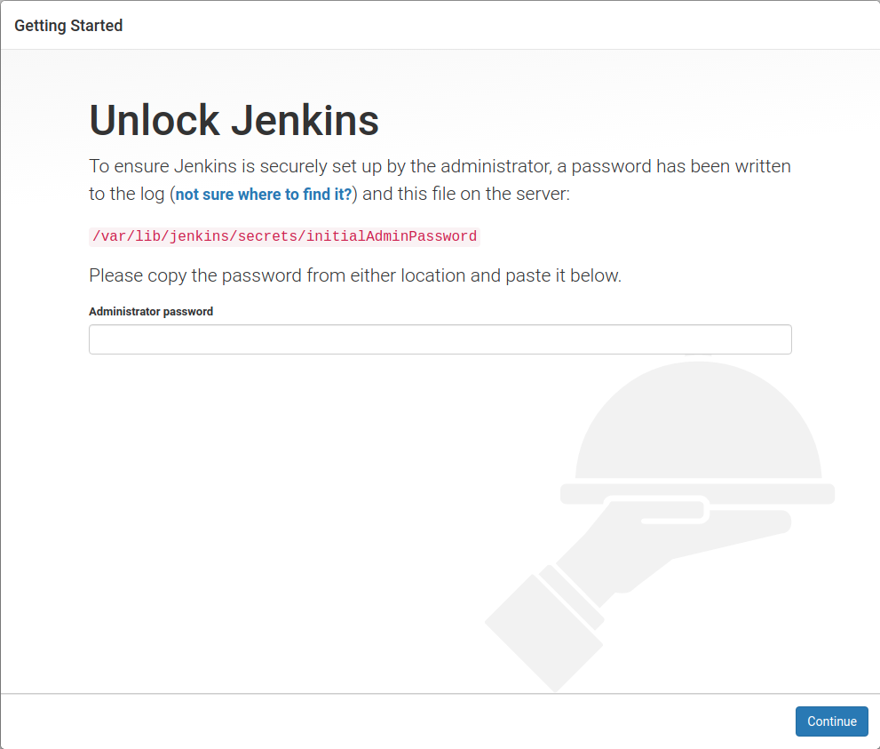

This indicates that there is a one time password file found in the above-mentioned directory. Make sure you have the correct access right to be able to open the file.

Once you have unlocked Jenkins the next step is to install some plugins that are required.
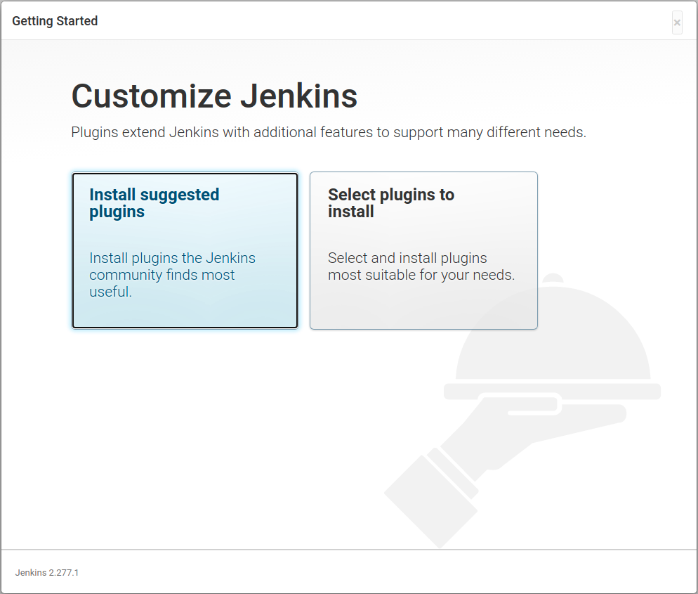

The recommended choice is to **Install Selected Plugins**. If you are experienced with Jenkins and now exactly which plugins to install, I don't think you should be reading this anyway :smirk:.

##### Jenkins Plugins #####
As a small side-note Jenkins plugins are the secret behind Jenkins power and popularity. Plugins are usually written by 3rd party organizations or inidividuals which extend the power of Jenkins Immensily. They allow for additional functionality that doesn't come with Jenkins by default.

#### Creating the First Admin User ####

In this step you are required the Jenkins' admin credentials. Make sure to save them somewhere external and safe because resetting the administrator user can be a daunting task.
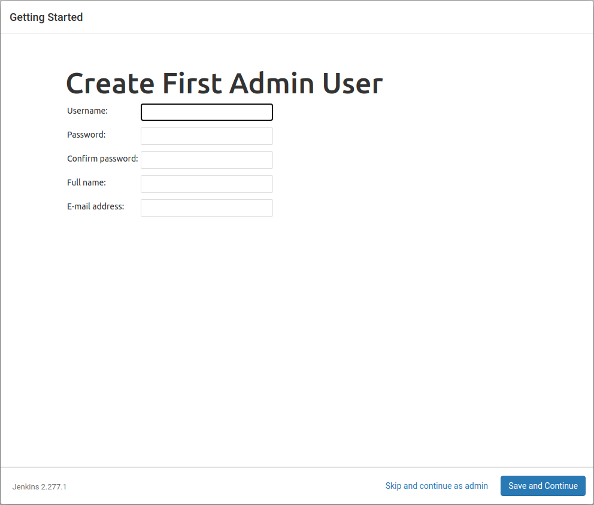


#### Setting up the Jenkins URL ####

In this step you can modify the Jenkins URL if you want to do so. For users that are not familiar with Jenkins, it is recommended to leave this value as is.
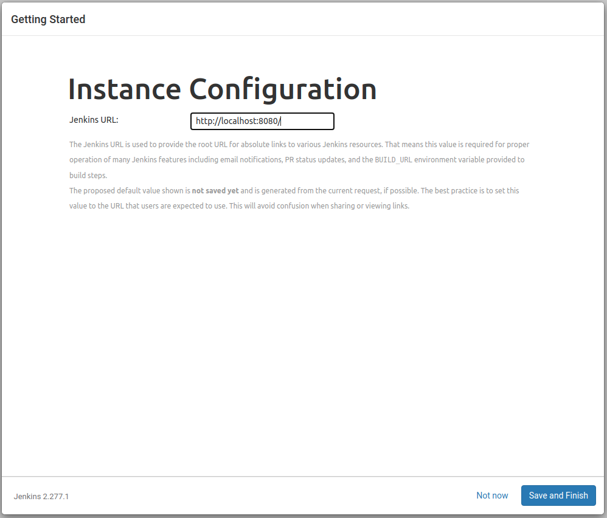

___

## Pipelines ##

Now that the Jenkins Installation is out of the way we can start by creating Jenkins Jobs. In our case the Job will be a Jenkins Pipeline.

What we aim to achieve in this project is to have a Jenkins pipeline that will run everytime a pull request is created. This pipeline will serve as a check mechanism to indicate whether the pull request is **safe to merge**.

How do we know if the pipeline passed the check? 

We will configure the pipeline to be able to communicate with Github.
When a pull request is submitted; a prompt will appear on the Github page showing the pipeline state:
* All checks are completed; code is safe to merge. (Pipeline outcome SUCCESS)
* Pending (Pipeline still running)
* Some/All checks have failed. (Pipeline failed)

###### What is a Jenkins pipeline ? ######

If we are to vulgarize the definition a bit, a Jenkins pipeline is, simply put, a sequence of running programs or scripts that are defined in a specific environment, in a specific order.

A Jenkins pipeline could be as simple as calling the echo command 2 times in a row.

###### Creating a Jenkins pipeline ######
* In order to create a Jenkins pipeline, one must login with their Jenkins user to the Jenkins web interface.
* Once logged in, you will be redirected to the Jenkins Dashboard.
* On the top left you will find a Button named **New Item**. Click On it.
* Enter the job name you wish to create. After that select Pipeline. Press **OK** to finish creating the pipeline.
* Congrats, you have created your first pipeline :dancer::dancer:

###### Configuring your first pipeline ######
Since we want the pipeline to be able to communicate with Github and communicate whether it has failed or not. We will be needing a plugin called "GitHub Pull Request Builder"


**To Download the plugin:**
* On the top left corner go to dashboard.
* On the left menu-bar select **Manage Jenkins**
* Click on **Manage Plugins**
* Go to the **Available** section and search for *Github Pull Request Builder*
* Tick the checkbox and on the bottom of the page click **Install without restart** 

Now that the plugin has been installed; we need to configure it.

* Once again go to **Manage Jenkins** and click on **Configure System**
* Scroll down to the **GitHub Pull Request Builder** 
* If you are not using GitHub enterprise to host your repo Leave the GitHub Server API URL as is
* Leave the Jenkins URL override field empty, especially if you are not using a Load Balancer for Jenkins.
* Should you want extra security; you can configure the Shared secret. You'll need to configure it on GitHub too. 
* For the credentials; it is recommended that you create a Jenkins user for the GitHub Repository and that user will be the one to be authenticated. When you want to create the credentials, use the email associated with the account as a username. Do not use the username itself. For the password field; it needs to be a Github API Token with the correct access rights.

You can always test your connection to the Github API. A helping screenshot is provided:
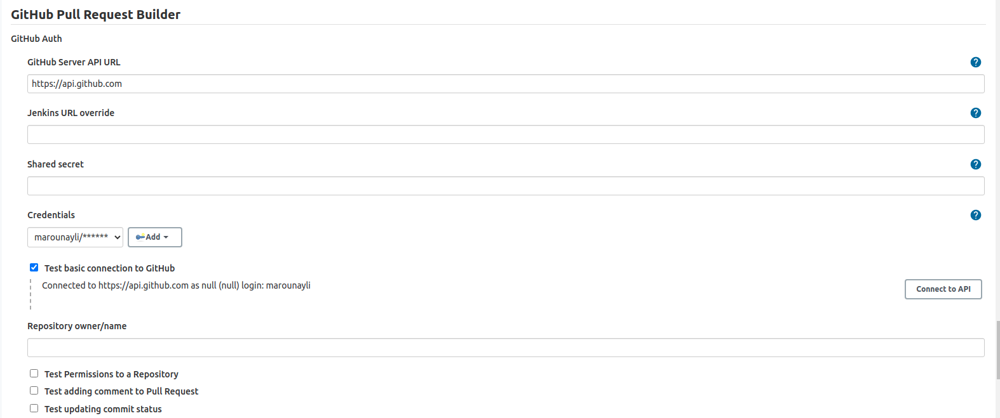

###### Now that the plugin installed we can go back to the pipeline configuration #######


###### General ######
* Go to dashboard, you'll find your newly created pipeline there. Click on it and then go to :gear: Configure.
* Enter your pipeline description in the **Description Box**
* Feel free to tinker with the options in the General Options; however what is required to correctly configure the project is to tick the GitHub project checkbox and specify the URL for the github repo.

###### Build Triggers ######
* Tick the GitHub Pull Request Builder Option
* Specify the Admin list (the usernames of the repo owners)
* Tick the option **Use github hooks for build triggering**
* Click Advanced
* Whitelist; you can add the users that will trigger the pipeline with their pull request. In this case we are aiming for everyone with access rights on the repository. We can supply the name of the organization in this case.
* There are many options to explore for furhter scrutiny

###### Pipeline ######
* Definition : Select Pipeline script from SCM 
* SCM : Git
* Repository URL : Your Github repo URL
* Add the credentials for the Jenkins Account
* Script Path : Relative Path of the Jenkins File to the repository root

## Connecting GitHub To a Local Jenkins Server ##

If you are new to Jenkins, chances are that you are still running Jenkins locally and you want to do some testing.

If you have some networking knowledge; you'd know that Github cannot directly communicate with your **localhost** because of the multiple NATs on the way. 

We need to expose the Jenkins Server to the Internet :earth_americas: :earth_americas: :earth_americas:

#### Ngrok ####
To achieve the above-mentioned we will be needing the help of a software called ngrok.

Ngrok is able to expose one of the ports of our local machine to the internet. To achieve this it uses a concept called Port Forwarding. To learn more about port forwarding please refer to the following [link](https://en.wikipedia.org/wiki/Port_forwarding)

Installing and running ngrok is really simple. All we have to do is to create a free account on the ngrok website to get an access token. When we get the access token all we have to do is:

Unzip the downloaded package:

```shell
dev1@idealworks~$ unzip /path/to/ngrok.zip
dev1@idealworks~$ ./ngrok authtoken <auth_token>
```

And then to finally create an HTTP tunnel between localhost and the internet on port 8080 we run:
```shell
dev1@idealworks~$ ./ngrok http 8080 
``` 

If the tunnel creation is successful, the output should be similar to:
```console
ngrok by @inconshreveable                                                                                                                                                                                                                                                                                       
Session Status                online                                                                                                                                                                               
Account                       dwijdiqow (Plan: Free)                                                                                                                                                               
Version                       2.3.35                                                                                                                                                                               
Region                        United States (us)                                                                                                                                                                   
Web Interface                 http://127.0.0.1:4040                                                                                                                                                                
Forwarding                    http://04380afafe7e.ngrok.io -> http://localhost:8080                                                                                                                                
Forwarding                    https://04380afafe7e.ngrok.io -> http://localhost:8080                                                                                                                               
                                                                                                                                                                                                                   
Connections                   ttl     opn     rt1     rt5     p50     p90                                                                                                                                          
                              38      0       0.00    0.01    5.32    14.80                                                                                                                                        
                                                                               
```
Now our jenkins is exposed to the internet via the following url : http://04380afafe7e.ngrok.io . This value obviously depends on the output. Don't try to copy this one... 
#### GitHub #### 

The last step is to link Github's API to our Jenkins Instance.
We will be using github's webhooks in order to inform jenkins of the different events to trigger pipeline build.

###### Creating a Github Webhook ######
* Navigate to your **Github Repository**
* Go to :gear: Settings :arrow_right: **Webhooks**
* Click on **Add webhook**
* In the **Payload URL** enter the following :`<generated_ngrok_url>/ghprbhook/` (:warning: Please don't forget the trailing / . If you remove it will cause the hook to fail. :tired_face:)
* Select application/json for the **Content Type**
* **Secret**: You can add the shared secret that you have specified when configuring the **Github Pull Request Builder**
* **Which events would you like to trigger this webhook?** : Select Individual events and select **Pull Requests** and remove **Pushes** which comes by default
* Make sure the active check-box is ticked.

Final Steps:

Now that everything is correctly set up, we can test the whole workflow.

On your repostiory, create a merge request from a branch to another. The pipeline should run on the newest branch. The success or failure of the pipeline will be shown on github in the following form:
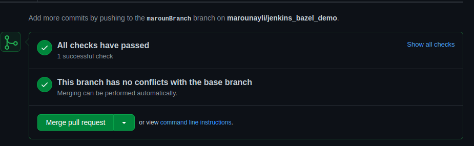

## Managing a branch protection rule ##

Branch protection rules are created to enforce certain workflows for one or more branches, such as passing status checks for all pull requests merged into the protected branch.

A name pattern specified with fnmatch syntax creates a branch protection rule in a repository for a specific branch, all branches, or any branch that matches it.
For example, to protect any branches containing the word feature, you can create a branch rule for \*feature*.

### Creating a branch protection rule ###
1. On GitHub, navigate to the main page of the repository.
2. Under your repository name, click Settings.
3. In the left menu, click Branches.
4. Next to "Branch protection rules", click Add rule.
5. Under "Branch name pattern", type the branch name or pattern you want to protect.

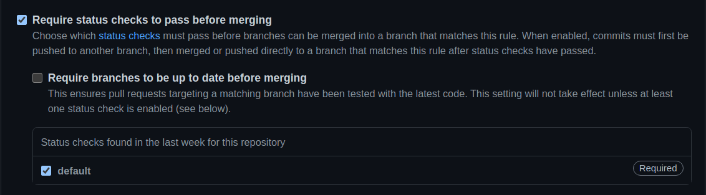

6. Enable required status checks by selecting Require status checks to pass before merging
7. From the list of available status checks, select the checks you want to require.

Now, before every pull request, checks are required to pass

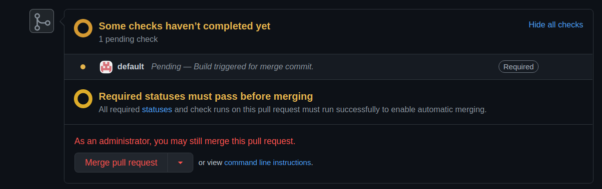

If checks are verified, the merge can be done.

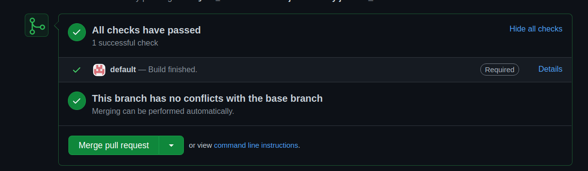

Else, the pull request can't be accepted until changes are done and checks pass.

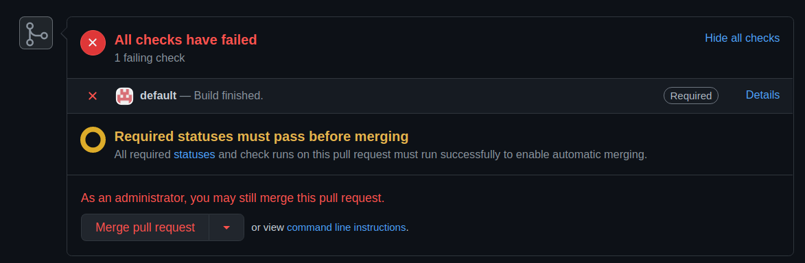


## Additional Features ##
 
### Showing the pipeline steps in the pull request. ###
You might want to show the Jenkins pipeline steps in the github pull request:

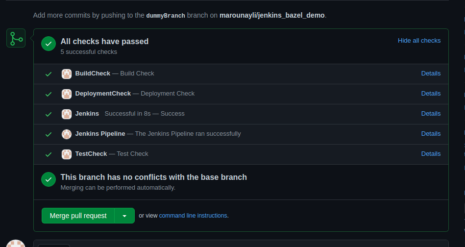


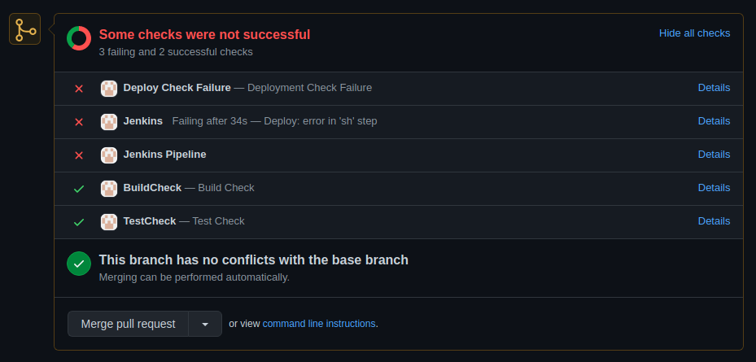


In order to show the pipeline steps within github we need the following:

* Jenkins plugin that implements the Jenkins Github Checks Interface
* Github application that is linked to the repository you are working on.

#### Configuring the Github Application ###

The first step is to create a Github application with limited access to the repository:

* Go to your profile -> Settings -> Developer Settings -> New Github App
* Give your app a unique name; this entry is compared to all Github Apps so don't use "Jenkins" as a name; it won't work.
* Write a description to your application; in this case it would be the Jenkins server.
* Homepage URL : The Jenkins public URL (Use the ngrok url)
* Callback URL : The Jenkins public URL
* Untick user authorization tokens
* Setup URL : The Jenkins public URL (Optional)
* Webhook URL : The Jenkins public URL + /github-webhook/
* Regarding the repository permissions you should enable the following
    * Checks : Access Read & Write
    * Metadata : Read-only (Mandatory by Github)
    * Pull requests : Read-only 
* Regarding events subscription:
    * Tick Pull Requests 
    * Tick Check Run

Once you create the application; you need to install it.
Install it only for the repository you need to pipeline to run on.
Finally to allow Jenkins to post the pipeline steps to Git it needs a special type of authentication to the Github app. This is why you download the app private key found on the bottom of the app page.
## Authenticate GitHub app to Jenkins

### Converting the key

After a couple of seconds the key will be downloaded to your downloads folder.

Now you need to convert the key into a different format that Jenkins can use:

```shell
openssl pkcs8 -topk8 -inform PEM -outform PEM -in key-in-your-downloads-folder.pem -out converted-github-app.pem -nocrypt
```

### Adding the Jenkins credential

- Go to your created pipeline

- Pick 'Configure'

- Choose 'Pipeline' and change Git SCM credentials

- Click Add -> Jenkins and fill out the form:

      Kind: GitHub app

      ID: i.e. github-app (could be anything as long as no other credential have the same ID)

      App ID: the github app ID, it can be found in the 'About' section of your GitHub app in the general tab.
      
    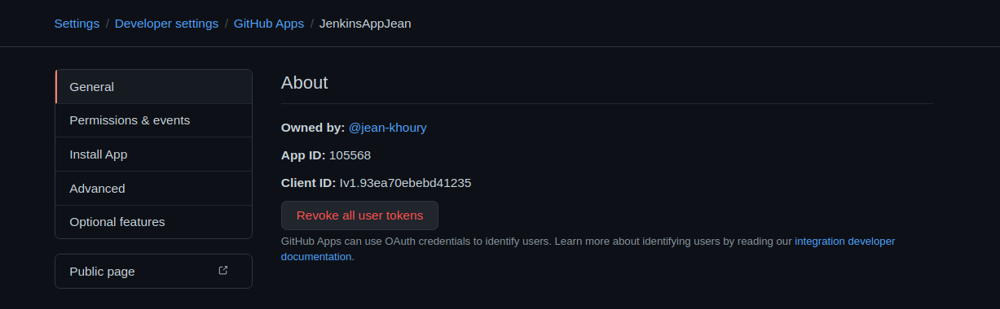

      API endpoint (optional, only required for GitHub enterprise this will only show up if a GitHub enterprise server is configured).

      Key: click add, paste the contents of the converted private key

- Click Add


### Downloading Checks API plugin

**To Download the plugin:**
* On the top left corner go to dashboard.
* On the left menu-bar select **Manage Jenkins**
* Click on **Manage Plugins**
* Go to the **Available** section and search for *Checks API plugin*
* Tick the checkbox and on the bottom of the page click **Install without restart** 